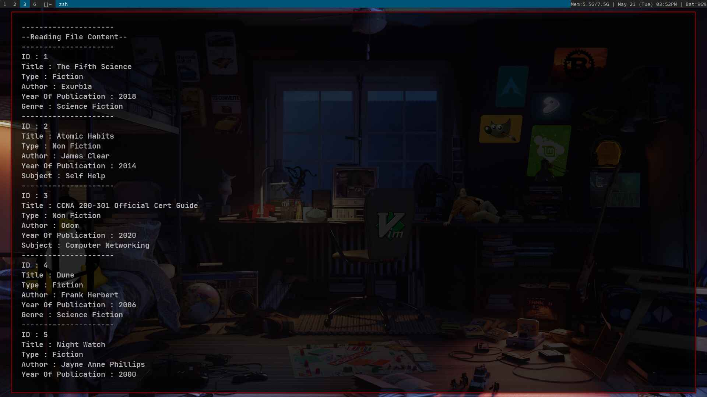

# Fast Reproduce

```shell
git clone https://github.com/chkg2a/Assignments /tmp/Assignments &&
cd /tmp/Assignments/B-Tech-1st-Year/2-Assignment\ on\ Wrap\ up\ programming\ exercise. &&
g++ code.cpp -o output && ./output &&
cd - &&
rm -rf /tmp/Assignments/
```

# Code 


# Simple Code

